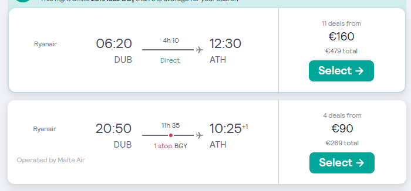

 
 
 

* [tasks](tasks.md)
* [slideck](slideck.md)

# CORK-DUB-ZRH-ATH-DEC22-JAN23

## Scyscanner preview

### Swiss

----

* Departure Dublin Saturday 18/12/2022
* Arrival Dublin Sunday 8/01/2023
----
* have to be at Dublin airport Saturday 18/12 at 10:40
    * Option 1 get the Cork-Dublin-Airport bus at 07:00
    * Option 2 travel to Dublin on Friday evening by train and stay at hotel

----

## RyanAir direct flights Dublin
> * 16/12 to 09/01

----

----

----

## Amsterdam 

----

----

##10/11/2022

----
16/12/2022

----

----

----

